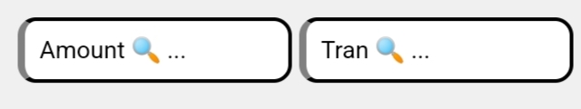

# FinPulse : Documentation

---

## 1. Introduction to FinPulse

FinPulse is a comprehensive money management web based software designed to simplify the way individuals to manage their personal finances. It offers features like balancing, tracking expenses, monitoring income, handling transactions, and providing insights into financial activity. The web is built to make financial management easy and accessible for all users.

---

## 2. Key Features of FinPulse

### 2.1 Balancing  
FinPulse allows users to easily monitor their financial balance by displaying total income and expenses. Users can see how much money they have after expenses, helping them maintain a positive balance and avoid overspending.

### 2.2 Expense Tracking  
Tracking expenses is essential for financial clarity. FinPulse helps users log and categorize their daily expenses, providing detailed reports on spending patterns. This allows for smarter financial decisions.

### 2.3 Income Monitoring  
Users can keep track of all income sources with FinPulse. Whether it’s a salary, business revenue, Scholrshpis or other streams, the web software shows a clear view of total income over time.

### 2.4 Transaction Summaries  
FinPulse offers a feature to view temporary summaries of transactions, providing users with an overview of their recent transactions, including date, amount, and category. This helps users track financial activity in real-time.

### 2.5 Dual Search Functionality  

#### 2.5.1 Amount Search  
FinPulse provides a search feature that allows users to quickly find information related to balances, expenses, and income. Users can type in specific amounts or keywords to locate balance data and see where money is allocated.

#### 2.5.2 Transaction Search  
FinPulse also allows users to search within their transactions. This feature is designed to locate specific transactions by amount, date, or category. Users can filter through their records to find exactly what they need.

### 2.6 TEMP BAL Feature  
The TEMP BAL feature calculates the total sum of the filtered transactions from the transaction search. Additionally, it highlights the top transactions exceeding 1000 INR. This gives users a quick snapshot of significant transactions and their impact on overall finances.

### 2.7 Add New Record & Add Transaction  
In the menu bar, users can easily create a new financial record by selecting the **Add New Record** option. Once a record is created, users can add transactions by using the plus (+) option within the record table. This intuitive process allows for easy management and entry of financial data.

### 2.8 Lend  
FinPulse includes a lending feature to track money lent to others. This functionality allows users to record and manage loans they have given, ensuring they keep track of amounts and repayment status.

---

## 5. Print FinPulse

FinPulse offers an option to print transaction statistics and amounts for physical records or reporting purposes:

---
## 3. Future Work

In upcoming versions of FinPulse, we plan to introduce advanced features like **Investment Tracking**, **Growth Analysis**, and **Loss Analysis**. These features will allow users to monitor their investment portfolios in real time and track the growth or loss of assets. These additions will further enhance the financial insights provided by FinPulse, helping users make more informed investment decisions.

---

## 4. Benefits of Using FinPulse

- **Comprehensive Financial Management**: FinPulse helps users track income, expenses, and balances, providing a complete view of their financial situation.
- **Dual Search Features**: Users can quickly search for specific amounts or filter transactions based on details like date and category.
- **TEMP BAL Feature**: This unique feature helps users focus on major transactions and quickly calculate filtered transaction sums.
- **Lending Management**: Users can track and manage money they have lent out, keeping records of loans and repayments.
- **User-Friendly Interface**: The interface is designed to be simple and intuitive, making it easy to create new records, add transactions, and access financial data efficiently.

---
